# 论文配图 Mermaid 模板库

> 软考机考内置画板工具可绘制各类图表，考生需在备考阶段熟悉标准图表结构。
> 本文件提供 mermaid 模板，用于生成备考练习中的结构化图表。
> 考试时需用机考画板手工还原，mermaid 仅用于备考阶段的可视化学习。

## 目录

- [一、甘特图（进度管理）](#一甘特图进度管理)
- [二、S曲线（成本管理）](#二s曲线成本管理)
- [三、网络图/PERT（进度管理）](#三网络图pert进度管理)
- [四、WBS分解树（范围管理）](#四wbs分解树范围管理)
- [五、干系人权力利益方格（干系人管理/绩效域）](#五干系人权力利益方格干系人管理绩效域)
- [六、绩效域协同关系图（绩效域论文）](#六绩效域协同关系图绩效域论文)
- [七、风险应对流程图（风险管理）](#七风险应对流程图风险管理)
- [八、业务流转图（通用）](#八业务流转图通用)
- [九、生命周期阶段图（开发方法和生命周期绩效域）](#九生命周期阶段图开发方法和生命周期绩效域)
- [十、度量指标仪表盘结构图（度量绩效域）](#十度量指标仪表盘结构图度量绩效域)
- [十一、挣值分析趋势图与跟踪表（成本管理/度量绩效域/规划绩效域）](#十一挣值分析趋势图与跟踪表成本管理度量绩效域规划绩效域)
- [十二、里程碑清单表（整合管理/通用）](#十二里程碑清单表整合管理通用)
- [十三、项目管理计划组成图（规划绩效域）](#十三项目管理计划组成图规划绩效域)
- [十四、塔克曼五阶段模型（团队绩效域）](#十四塔克曼五阶段模型团队绩效域)
- [十五、帕累托图（质量管理）](#十五帕累托图质量管理)
- [十六、控制图（质量管理）](#十六控制图质量管理)
- [十七、沟通渠道分析与沟通节奏图（沟通管理）](#十七沟通渠道分析与沟通节奏图沟通管理)
- [十八、自制或外购决策矩阵（采购管理）](#十八自制或外购决策矩阵采购管理)
- [十九、需求跟踪矩阵（范围管理）](#十九需求跟踪矩阵范围管理)
- [二十、风险概率影响矩阵（风险管理）](#二十风险概率影响矩阵风险管理)
- [二十一、真题高频补充图表（质量核对单/进度计划）](#二十一真题高频补充图表质量核对单进度计划)

---

## 一、甘特图（进度管理）

**考试要点**：横轴为时间，纵轴为工作包/活动，用条形表示起止时间，标注关键路径。

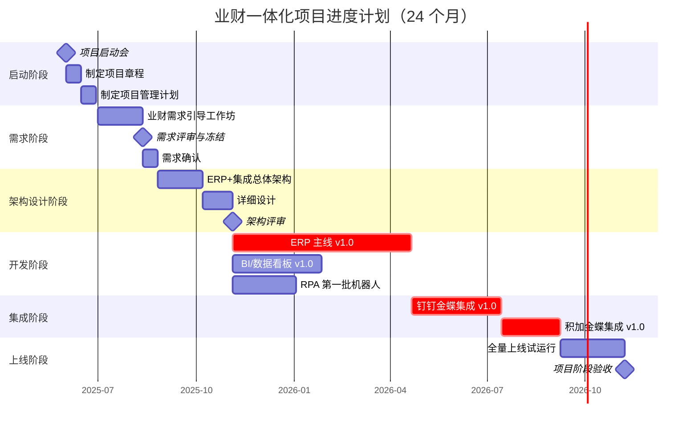
```mermaid
gantt
    title 业财一体化项目进度计划（24 个月）
    dateFormat YYYY-MM-DD
    axisFormat %Y-%m

    section 启动阶段
    项目启动会           :milestone, m1, 2025-06-01, 0d
    制定项目章程         :a1, 2025-06-01, 14d
    制定项目管理计划     :a2, after a1, 14d

    section 需求阶段
    业财需求引导工作坊   :b1, 2025-07-01, 42d
    需求评审与冻结       :milestone, m2, after b1, 0d
    需求确认             :b2, after b1, 14d

    section 架构设计阶段
    ERP+集成总体架构     :c1, after b2, 42d
    详细设计             :c2, after c1, 28d
    架构评审             :milestone, m3, after c2, 0d

    section 开发阶段
    ERP 主线 v1.0        :crit, d1, after c2, 168d
    BI/数据看板 v1.0     :d2, after c2, 84d
    RPA 第一批机器人     :d3, after c2, 60d

    section 集成阶段
    钉钉金蝶集成 v1.0    :crit, e1, after d1, 84d
    积加金蝶集成 v1.0    :crit, e2, after e1, 56d

    section 上线阶段
    全量上线试运行       :f1, after e2, 60d
    项目阶段验收         :milestone, m4, after f1, 0d
```

**考试画板绘制要点**：
- 先画横轴（时间）和纵轴（工作包）
- 关键路径用粗线或不同颜色标注
- 里程碑用菱形◆标记
- 不需要精确比例，概念正确即可

---

## 二、S曲线（成本管理）

**考试要点**：横轴=时间，纵轴=累计成本，S形曲线从0开始到BAC结束。2024年第2批成本管理真题明确要求画出S曲线。

**说明**：mermaid 的 xychart-beta 可绘制基础S曲线，若渲染不支持则参考下方文字模板。

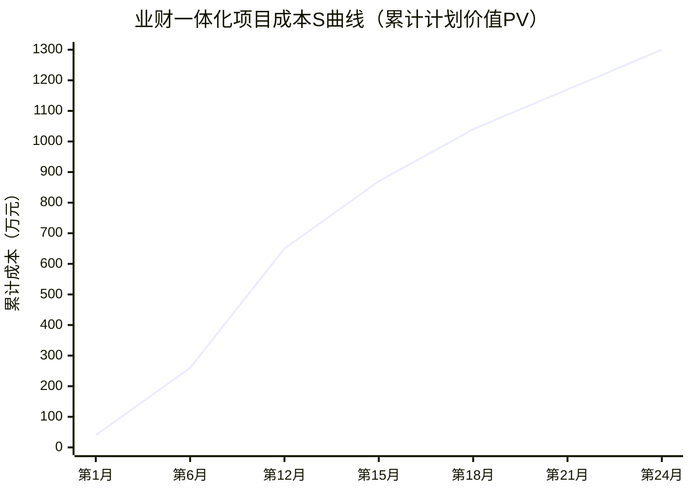
```mermaid
xychart-beta
    title "业财一体化项目成本S曲线（累计计划价值PV）"
    x-axis ["第1月", "第6月", "第12月", "第15月", "第18月", "第21月", "第24月"]
    y-axis "累计成本（万元）" 0 --> 1300
    line [40, 260, 650, 870, 1040, 1170, 1300]
```

**考试画板绘制要点（判分标准）**：
1. 横坐标必须是时间
2. 纵坐标必须是成本
3. 起始值必须是 0
4. 结束值必须是完工预算（BAC）
5. 中间看起来像条 S 形曲线即可
6. 可额外画 EV 线和 AC 线（不强制）

**文字模板（考试可用，BAC=1300 万）**：

```
累计成本(万元)
1300 |                          ╭────── BAC
     |                     ╭────╯
1040 |                ╭────╯
     |           ╭───╯
 650 |      ╭───╯
     | ╭───╯
 260 |╯
     |
  40 |╮
   0 |─────────────────────────────── 时间(月)
     1    6    12   15   18   21   24
```

---

## 三、网络图/PERT（进度管理）

**考试要点**：展示活动之间的逻辑依赖关系（FS/FF/SS/SF），标注关键路径和浮动时间。

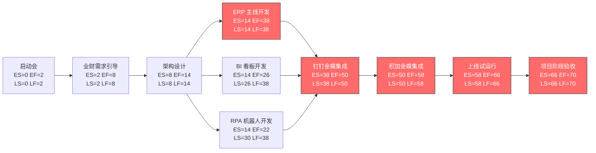
```mermaid
flowchart LR
    A["启动会<br/>ES=0 EF=2<br/>LS=0 LF=2"] --> B["业财需求引导<br/>ES=2 EF=8<br/>LS=2 LF=8"]
    B --> C["架构设计<br/>ES=8 EF=14<br/>LS=8 LF=14"]
    C --> D["ERP 主线开发<br/>ES=14 EF=38<br/>LS=14 LF=38"]
    C --> E["BI 看板开发<br/>ES=14 EF=26<br/>LS=26 LF=38"]
    C --> F["RPA 机器人开发<br/>ES=14 EF=22<br/>LS=30 LF=38"]
    D --> G["钉钉金蝶集成<br/>ES=38 EF=50<br/>LS=38 LF=50"]
    E --> G
    F --> G
    G --> H["积加金蝶集成<br/>ES=50 EF=58<br/>LS=50 LF=58"]
    H --> I["上线试运行<br/>ES=58 EF=66<br/>LS=58 LF=66"]
    I --> J["项目阶段验收<br/>ES=66 EF=70<br/>LS=66 LF=70"]

    style D fill:#ff6b6b,stroke:#333,color:#fff
    style G fill:#ff6b6b,stroke:#333,color:#fff
    style H fill:#ff6b6b,stroke:#333,color:#fff
    style I fill:#ff6b6b,stroke:#333,color:#fff
    style J fill:#ff6b6b,stroke:#333,color:#fff
```

> 红色标注为关键路径（总浮动时间 = 0），关键路径工期 = 70 周（约 16 个月）。

**考试画板绘制要点**：
- 用圆圈或方框表示活动节点
- 箭头表示依赖关系
- 关键路径用粗线/红线标注
- 在节点旁标注 ES/EF/LS/LF（如有要求）

---

## 四、WBS分解树（范围管理）

**考试要点**：展示层次分解结构，体现"100%规则"和编码体系。

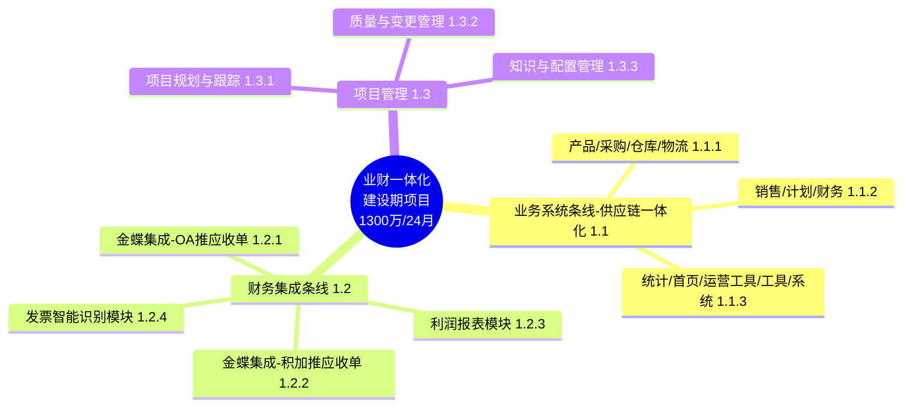
```mermaid
mindmap
  root((业财一体化<br/>建设期项目<br/>1300万/24月))
    业务系统条线-供应链一体化 1.1
      产品/采购/仓库/物流 1.1.1
      销售/计划/财务 1.1.2
      统计/首页/运营工具/工具/系统 1.1.3
    财务集成条线 1.2
      金蝶集成-OA推应收单 1.2.1
      金蝶集成-积加推应收单 1.2.2
      利润报表模块 1.2.3
      发票智能识别模块 1.2.4
    项目管理 1.3
      项目规划与跟踪 1.3.1
      质量与变更管理 1.3.2
      知识与配置管理 1.3.3
```

**考试画板绘制要点**：
- 树状结构，从上到下或从左到右展开
- 每个节点标注WBS编码
- 同级节点之和 = 父节点（100%规则）
- 最底层为工作包（Work Package），可分配责任人和工期

---

## 五、干系人权力利益方格（干系人管理/绩效域）

**考试要点**：2023下第1批真题核心得分点。权力利益方格用于分类管理策略，参与度评估矩阵需画两次（规划+监督）。

### 5.1 权力/利益方格

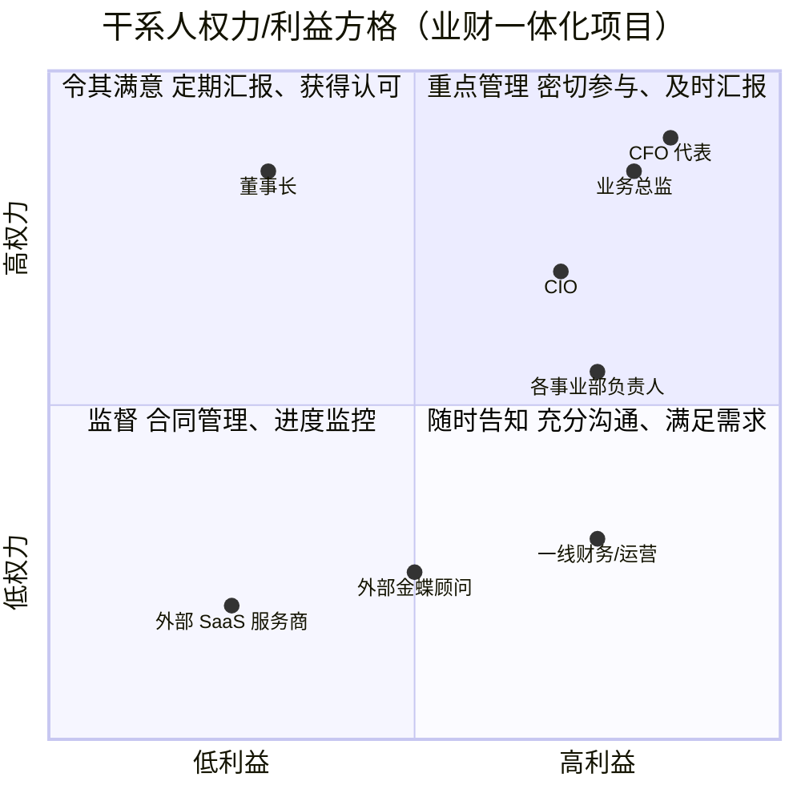
```mermaid
quadrantChart
    title 干系人权力/利益方格（业财一体化项目）
    x-axis "低利益" --> "高利益"
    y-axis "低权力" --> "高权力"
    quadrant-1 "重点管理 密切参与、及时汇报"
    quadrant-2 "令其满意 定期汇报、获得认可"
    quadrant-3 "监督 合同管理、进度监控"
    quadrant-4 "随时告知 充分沟通、满足需求"
    "董事长": [0.3, 0.85]
    "CFO 代表": [0.85, 0.9]
    "业务总监": [0.8, 0.85]
    "CIO": [0.7, 0.7]
    "各事业部负责人": [0.75, 0.55]
    "一线财务/运营": [0.75, 0.3]
    "外部金蝶顾问": [0.5, 0.25]
    "外部 SaaS 服务商": [0.25, 0.2]
```

### 5.2 干系人参与度评估矩阵（需画两次）

**第一次：规划阶段（期望参与度）**

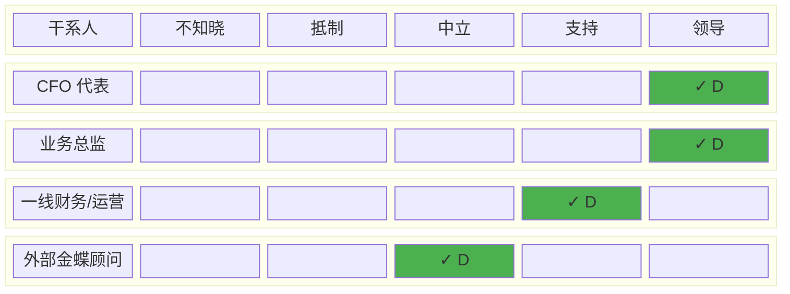
```mermaid
block-beta
    columns 6
    block:header:6
        columns 6
        h1["干系人"]:1 h2["不知晓"]:1 h3["抵制"]:1 h4["中立"]:1 h5["支持"]:1 h6["领导"]:1
    end
    block:r1:6
        columns 6
        a1["CFO 代表"]:1 a2[" "]:1 a3[" "]:1 a4[" "]:1 a5[" "]:1 a6["✓ D"]:1
    end
    block:r2:6
        columns 6
        b1["业务总监"]:1 b2[" "]:1 b3[" "]:1 b4[" "]:1 b5[" "]:1 b6["✓ D"]:1
    end
    block:r3:6
        columns 6
        c1["一线财务/运营"]:1 c2[" "]:1 c3[" "]:1 c4[" "]:1 c5["✓ D"]:1 c6[" "]:1
    end
    block:r4:6
        columns 6
        d1["外部金蝶顾问"]:1 d2[" "]:1 d3[" "]:1 d4["✓ D"]:1 d5[" "]:1 d6[" "]:1
    end

    style a6 fill:#4CAF50,color:#fff
    style b6 fill:#4CAF50,color:#fff
    style c5 fill:#4CAF50,color:#fff
    style d4 fill:#4CAF50,color:#fff
```

> D = 期望（Desired）参与状态

**第二次：监督阶段（当前 vs 期望）**

> 此处建议在论文中使用 Markdown 表格展示，参见 paper-framework.md 第十节干系人管理类表格中的"干系人参与度评估矩阵表"（包含 C=当前/D=期望 标记和差距分析列）。

---

## 六、绩效域协同关系图（绩效域论文）

**考试要点**：2025上交付绩效域和不确定性绩效域均要求分析与其他绩效域的协同关系。此图展示8大绩效域之间的相互作用。

### 6.1 全域协同关系图

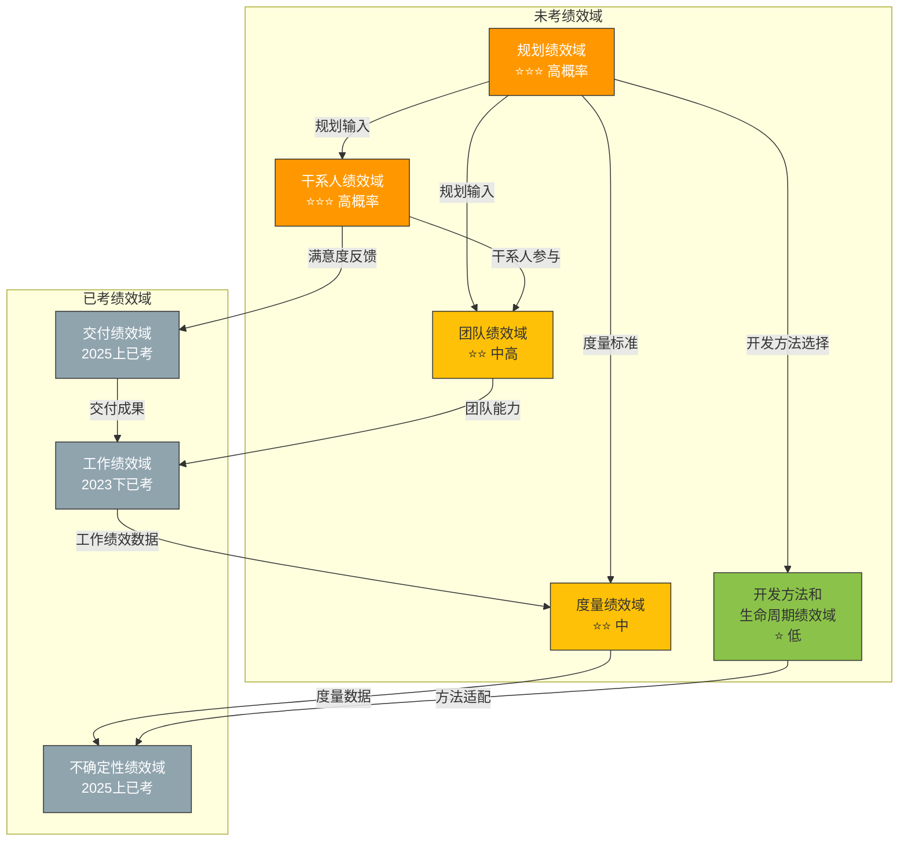
```mermaid
flowchart TB
    subgraph 未考绩效域
        S1["干系人绩效域<br/>⭐⭐⭐ 高概率"]
        S2["规划绩效域<br/>⭐⭐⭐ 高概率"]
        S3["团队绩效域<br/>⭐⭐ 中高"]
        S4["度量绩效域<br/>⭐⭐ 中"]
        S5["开发方法和<br/>生命周期绩效域<br/>⭐ 低"]
    end

    subgraph 已考绩效域
        S6["工作绩效域<br/>2023下已考"]
        S7["交付绩效域<br/>2025上已考"]
        S8["不确定性绩效域<br/>2025上已考"]
    end

    S2 -->|规划输入| S1
    S2 -->|规划输入| S3
    S2 -->|度量标准| S4
    S2 -->|开发方法选择| S5
    S1 -->|干系人参与| S3
    S1 -->|满意度反馈| S7
    S3 -->|团队能力| S6
    S4 -->|度量数据| S8
    S5 -->|方法适配| S8
    S7 -->|交付成果| S6
    S6 -->|工作绩效数据| S4

    style S1 fill:#ff9800,stroke:#333,color:#fff
    style S2 fill:#ff9800,stroke:#333,color:#fff
    style S3 fill:#ffc107,stroke:#333
    style S4 fill:#ffc107,stroke:#333
    style S5 fill:#8bc34a,stroke:#333
    style S6 fill:#90a4ae,stroke:#333,color:#fff
    style S7 fill:#90a4ae,stroke:#333,color:#fff
    style S8 fill:#90a4ae,stroke:#333,color:#fff
```

### 6.2 干系人绩效域协同图（2026高概率考点）

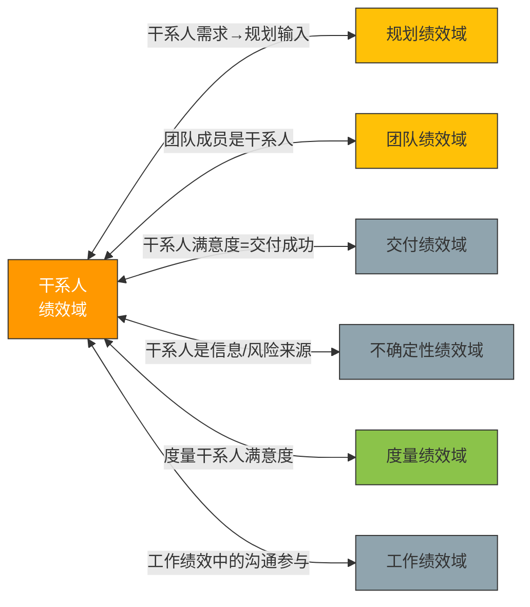
```mermaid
flowchart LR
    STAKE["干系人<br/>绩效域"]

    STAKE <-->|"干系人需求→规划输入"| PLAN["规划绩效域"]
    STAKE <-->|"团队成员是干系人"| TEAM["团队绩效域"]
    STAKE <-->|"干系人满意度=交付成功"| DELIVER["交付绩效域"]
    STAKE <-->|"干系人是信息/风险来源"| UNCERT["不确定性绩效域"]
    STAKE <-->|"度量干系人满意度"| MEASURE["度量绩效域"]
    STAKE <-->|"工作绩效中的沟通参与"| WORK["工作绩效域"]

    style STAKE fill:#ff9800,stroke:#333,color:#fff
    style PLAN fill:#ffc107,stroke:#333
    style TEAM fill:#ffc107,stroke:#333
    style DELIVER fill:#90a4ae,stroke:#333
    style UNCERT fill:#90a4ae,stroke:#333
    style MEASURE fill:#8bc34a,stroke:#333
    style WORK fill:#90a4ae,stroke:#333
```

### 6.3 五大过程组×绩效域协同表（2025上交付绩效域考法）

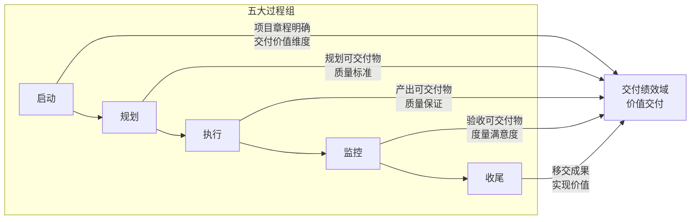
```mermaid
flowchart LR
    subgraph 五大过程组
        I["启动"] --> P["规划"] --> E["执行"] --> M["监控"] --> C["收尾"]
    end

    I -->|"项目章程明确<br/>交付价值维度"| D["交付绩效域<br/>价值交付"]
    P -->|"规划可交付物<br/>质量标准"| D
    E -->|"产出可交付物<br/>质量保证"| D
    M -->|"验收可交付物<br/>度量满意度"| D
    C -->|"移交成果<br/>实现价值"| D
```

---

## 七、风险应对流程图（风险管理）

**考试要点**：展示从风险识别到应对策略选择的完整流程。

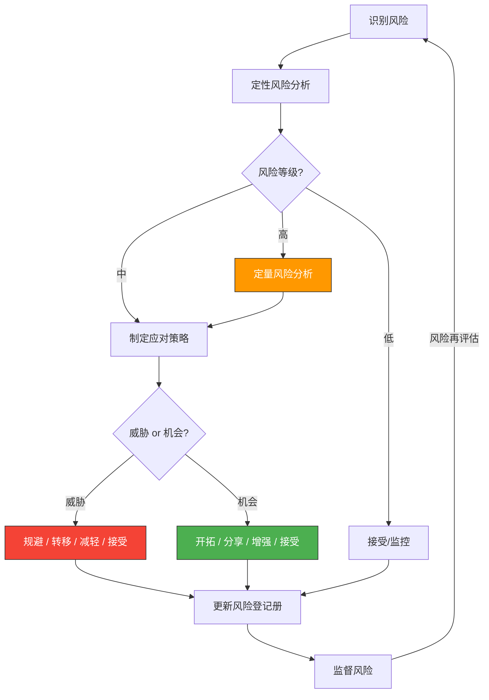
```mermaid
flowchart TD
    A[识别风险] --> B[定性风险分析]
    B --> C{风险等级?}
    C -->|高| D[定量风险分析]
    C -->|中| E[制定应对策略]
    C -->|低| F[接受/监控]
    D --> E

    E --> G{威胁 or 机会?}
    G -->|威胁| H[规避 / 转移 / 减轻 / 接受]
    G -->|机会| I[开拓 / 分享 / 增强 / 接受]

    H --> J[更新风险登记册]
    I --> J
    F --> J
    J --> K[监督风险]
    K -->|风险再评估| A

    style D fill:#ff9800,stroke:#333,color:#fff
    style H fill:#f44336,stroke:#333,color:#fff
    style I fill:#4CAF50,stroke:#333,color:#fff
```

---

## 八、业务流转图（通用）

**考试要点**：展示业务流程或系统交互，适用于背景段落和正文中的场景描述。

### 8.1 业财一体化业务流转（示例）

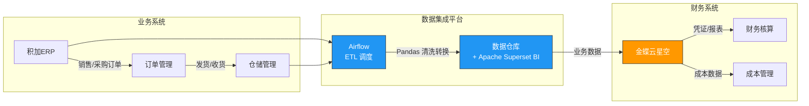
```mermaid
flowchart LR
    subgraph 业务系统
        ERP["积加ERP"] --> |"销售/采购订单"| OMS["订单管理"]
        OMS --> |"发货/收货"| WMS["仓储管理"]
    end

    subgraph 数据集成平台
        ETL["Airflow<br/>ETL 调度"] --> |"Pandas 清洗转换"| DW["数据仓库<br/>+ Apache Superset BI"]
    end

    subgraph 财务系统
        DW --> |"业务数据"| KINGDEE["金蝶云星空"]
        KINGDEE --> |"凭证/报表"| FIN["财务核算"]
        KINGDEE --> |"成本数据"| COST["成本管理"]
    end

    ERP --> ETL
    WMS --> ETL

    style ETL fill:#2196F3,stroke:#333,color:#fff
    style DW fill:#2196F3,stroke:#333,color:#fff
    style KINGDEE fill:#FF9800,stroke:#333,color:#fff
```

### 8.2 变更控制流程（整合管理）

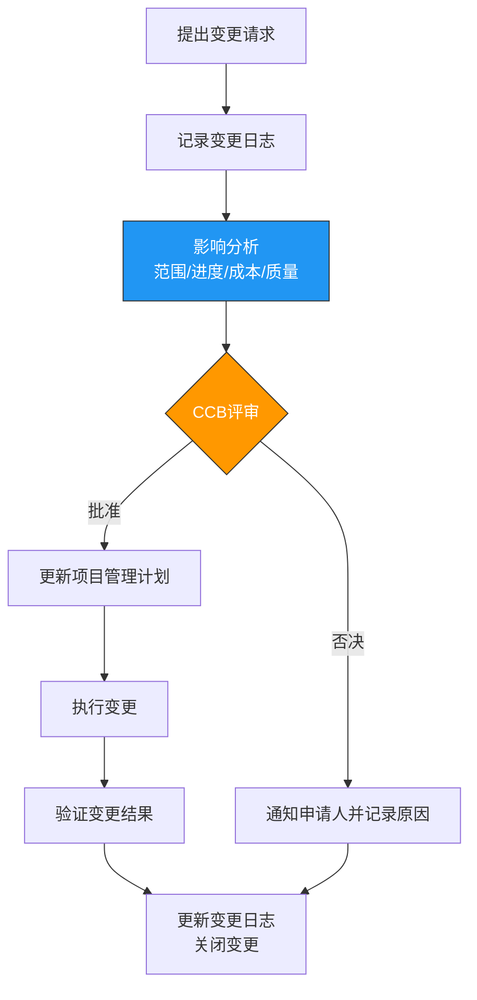
```mermaid
flowchart TD
    A[提出变更请求] --> B[记录变更日志]
    B --> C[影响分析<br/>范围/进度/成本/质量]
    C --> D{CCB评审}
    D -->|批准| E[更新项目管理计划]
    D -->|否决| F[通知申请人并记录原因]
    E --> G[执行变更]
    G --> H[验证变更结果]
    H --> I[更新变更日志<br/>关闭变更]
    F --> I

    style D fill:#ff9800,stroke:#333,color:#fff
    style C fill:#2196F3,stroke:#333,color:#fff
```

---

## 九、生命周期阶段图（开发方法和生命周期绩效域）

**考试要点**：展示交付节奏与开发方法的协调关系。

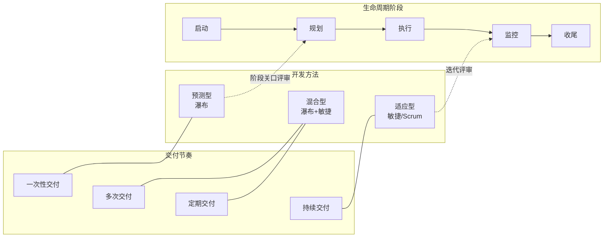
```mermaid
flowchart LR
    subgraph 交付节奏
        R1["一次性交付"] ~~~ R2["多次交付"] ~~~ R3["定期交付"] ~~~ R4["持续交付"]
    end

    subgraph 开发方法
        M1["预测型<br/>瀑布"] ~~~ M2["混合型<br/>瀑布+敏捷"] ~~~ M3["适应型<br/>敏捷/Scrum"]
    end

    R1 --- M1
    R2 --- M2
    R3 --- M2
    R4 --- M3

    subgraph 生命周期阶段
        P1["启动"] --> P2["规划"] --> P3["执行"] --> P4["监控"] --> P5["收尾"]
    end

    M1 -.->|"阶段关口评审"| P2
    M3 -.->|"迭代评审"| P4
```

---

## 十、度量指标仪表盘结构图（度量绩效域）

**考试要点**：展示度量指标的层次结构和关联关系。

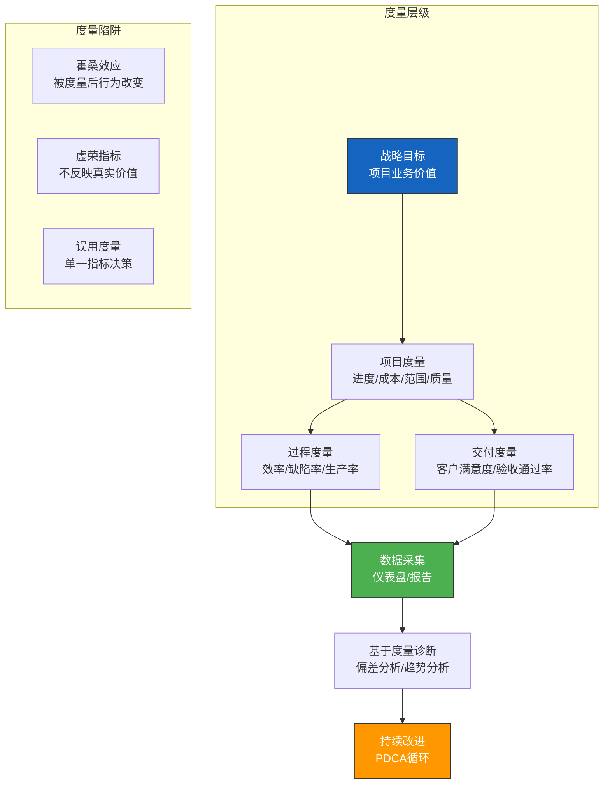
```mermaid
flowchart TB
    subgraph 度量层级
        L1["战略目标<br/>项目业务价值"] --> L2["项目度量<br/>进度/成本/范围/质量"]
        L2 --> L3["过程度量<br/>效率/缺陷率/生产率"]
        L2 --> L4["交付度量<br/>客户满意度/验收通过率"]
    end

    subgraph 度量陷阱
        T1["霍桑效应<br/>被度量后行为改变"]
        T2["虚荣指标<br/>不反映真实价值"]
        T3["误用度量<br/>单一指标决策"]
    end

    L3 --> D["数据采集<br/>仪表盘/报告"]
    L4 --> D
    D --> A["基于度量诊断<br/>偏差分析/趋势分析"]
    A --> I["持续改进<br/>PDCA循环"]

    style L1 fill:#1565C0,stroke:#333,color:#fff
    style D fill:#4CAF50,stroke:#333,color:#fff
    style I fill:#FF9800,stroke:#333,color:#fff
```

---

## 十一、挣值分析趋势图与跟踪表（成本管理/度量绩效域/规划绩效域）

**考试要点**：EVM 挣值管理是成本管理和度量绩效域的核心工具，2024第2批成本管理真题要求理解成本基准形成过程。趋势图展示 SPI/CPI 随时间变化，配合跟踪表使用。

### 11.1 SPI/CPI 趋势图

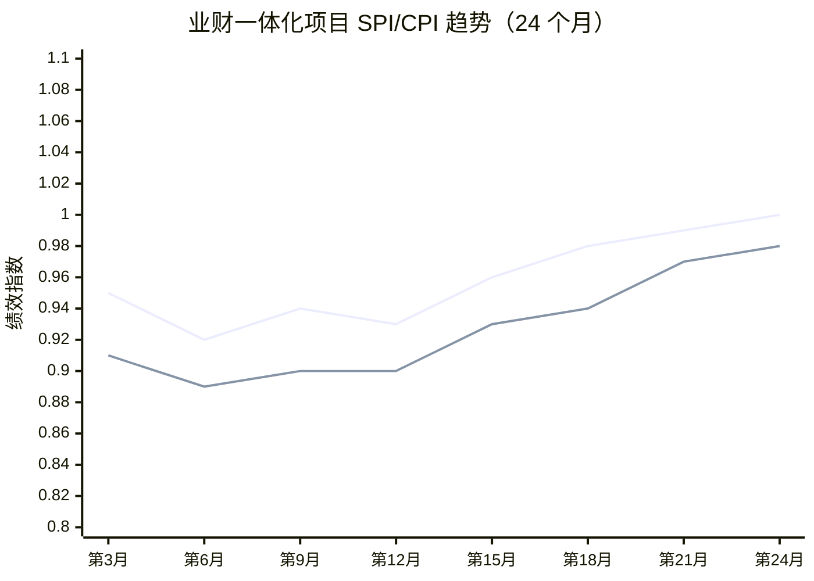
```mermaid
xychart-beta
    title "业财一体化项目 SPI/CPI 趋势（24 个月）"
    x-axis ["第3月", "第6月", "第9月", "第12月", "第15月", "第18月", "第21月", "第24月"]
    y-axis "绩效指数" 0.8 --> 1.1
    line [0.95, 0.92, 0.94, 0.93, 0.96, 0.98, 0.99, 1.00]
    line [0.91, 0.89, 0.90, 0.90, 0.93, 0.94, 0.97, 0.98]
```

> 上线 = SPI（进度绩效指数），下线 = CPI（成本绩效指数）。基准线 = 1.0，低于 1.0 表示落后/超支。

**考试画板绘制要点**：
- 先画横轴（时间）和纵轴（0.8-1.1）
- 画一条基准线 y=1.0（虚线）
- SPI 和 CPI 两条曲线，低于 1.0 段标注偏差原因
- 趋势应向 1.0 收敛（体现纠偏效果）

### 11.2 挣值分析跟踪表（考场直接画表）

| 指标 | 第6月 | 第12月 | 第18月 | 第24月 |
|-----|------|-------|-------|-------|
| PV（计划价值） | 260万 | 650万 | 1040万 | 1300万 |
| EV（挣值） | 240万 | 605万 | 1020万 | 1300万 |
| AC（实际成本） | 270万 | 670万 | 1080万 | 1330万 |
| SV（进度偏差） | -20万 | -45万 | -20万 | 0万 |
| CV（成本偏差） | -30万 | -65万 | -60万 | -30万 |
| SPI（进度绩效） | 0.92 | 0.93 | 0.98 | 1.00 |
| CPI（成本绩效） | 0.89 | 0.90 | 0.94 | 0.98 |
| EAC（完工估算） | 1461万 | 1444万 | 1383万 | 1327万 |

**考试画板绘制要点**：
- 表头：指标名称 + 各度量节点
- 关键行：PV/EV/AC（绝对值）+ SPI/CPI（指数，保留两位小数）
- EAC = BAC / CPI（典型偏差公式）
- 必须写出计算公式再填数值，体现专业性

---

## 十二、里程碑清单表（整合管理/通用）

**考试要点**：整合管理论文背景段和监控段常用，体现项目阶段划分和关键节点。里程碑是整合管理的核心交付物之一。

| 里程碑 | 名称 | 计划日期 | 交付物 | 状态 |
|--------|------|---------|--------|------|
| M1 | 项目启动会 | 2025-06-01 | 项目章程、干系人登记册 | ✅ 已完成 |
| M2 | 需求冻结 | 2025-08-15 | 需求规格说明书、范围基准 | ✅ 已完成 |
| M3 | 架构评审通过 | 2025-10-01 | 系统架构设计文档 | ✅ 已完成 |
| M4 | 财务集成条线 v1.0 上线 | 2026-02-28 | 钉钉金蝶/积加金蝶集成模块 | ✅ 已完成 |
| M5 | ERP 主线 v1.0 开发完成 | 2026-08-31 | 12 主模块功能交付 | 🔄 进行中 |
| M6 | 全量上线试运行 | 2027-02-28 | 业财一体化系统全量验收 | ⏳ 未开始 |

**考试画板绘制要点**：
- 简单表格即可，列：里程碑编号 / 名称 / 计划日期 / 交付物 / 状态
- 状态用 ✅🔄⏳ 标注（或用文字"已完成/进行中/未开始"）
- 里程碑数量 5-8 个为宜，覆盖项目全生命周期

---

## 十三、项目管理计划组成图（规划绩效域）

**考试要点**：规划绩效域（T1 梯队）需展示各子计划之间的关联关系，体现规划的系统性。

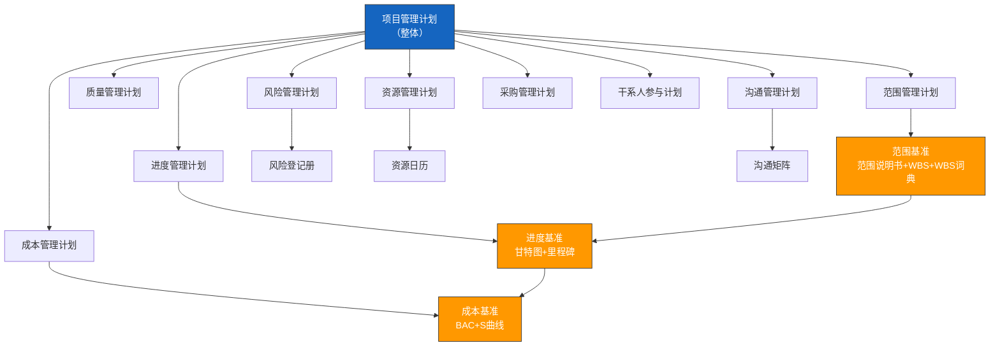
```mermaid
flowchart TB
    PP["项目管理计划<br/>（整体）"]

    PP --> SP["范围管理计划"]
    PP --> SDP["进度管理计划"]
    PP --> CP["成本管理计划"]
    PP --> QP["质量管理计划"]
    PP --> RP["资源管理计划"]
    PP --> CP2["沟通管理计划"]
    PP --> KP["风险管理计划"]
    PP --> PP2["采购管理计划"]
    PP --> SKP["干系人参与计划"]

    SP --> RB["范围基准<br/>范围说明书+WBS+WBS词典"]
    SDP --> SB["进度基准<br/>甘特图+里程碑"]
    CP --> CB["成本基准<br/>BAC+S曲线"]

    RB --> SB
    SB --> CB

    KP --> KR["风险登记册"]
    RP --> RC["资源日历"]
    CP2 --> CM["沟通矩阵"]

    style PP fill:#1565C0,stroke:#333,color:#fff
    style RB fill:#FF9800,stroke:#333,color:#fff
    style SB fill:#FF9800,stroke:#333,color:#fff
    style CB fill:#FF9800,stroke:#333,color:#fff
```

**考试画板绘制要点**：
- 顶部"项目管理计划"为中心节点
- 向下展开 9 个子计划
- 重点标注三大基准（范围/进度/成本基准）及其相互依赖
- 不需要全部画出，重点展示 3-5 个与论文主题相关的子计划

---

## 十四、塔克曼五阶段模型（团队绩效域）

**考试要点**：团队绩效域（T2 梯队）核心理论图，展示团队发展的五个阶段及效能变化。

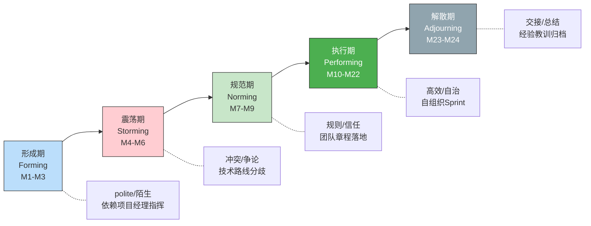
```mermaid
flowchart LR
    A["形成期<br/>Forming<br/>M1-M3"] --> B["震荡期<br/>Storming<br/>M4-M6"]
    B --> C["规范期<br/>Norming<br/>M7-M9"]
    C --> D["执行期<br/>Performing<br/>M10-M22"]
    D --> E["解散期<br/>Adjourning<br/>M23-M24"]

    A -.- N1[" polite/陌生<br/>依赖项目经理指挥"]
    B -.- N2[" 冲突/争论<br/>技术路线分歧"]
    C -.- N3[" 规则/信任<br/>团队章程落地"]
    D -.- N4[" 高效/自治<br/>自组织Sprint"]
    E -.- N5[" 交接/总结<br/>经验教训归档"]

    style A fill:#BBDEFB,stroke:#333
    style B fill:#FFCDD2,stroke:#333
    style C fill:#C8E6C9,stroke:#333
    style D fill:#4CAF50,stroke:#333,color:#fff
    style E fill:#90A4AE,stroke:#333,color:#fff
```

**考试画板绘制要点**：
- 横轴画时间线，标注五个阶段
- 纵轴画团队效能曲线（低→高，震荡期下降后持续上升）
- 每个阶段标注关键特征（1-2 个关键词）
- 可结合项目实际标注时间节点

---

## 十五、帕累托图（质量管理）

**考试要点**：质量管理七工具之首，"二八原则"——80%的问题由 20%的原因造成。质量管理（T2 梯队）论文必用。

### 15.1 帕累托图

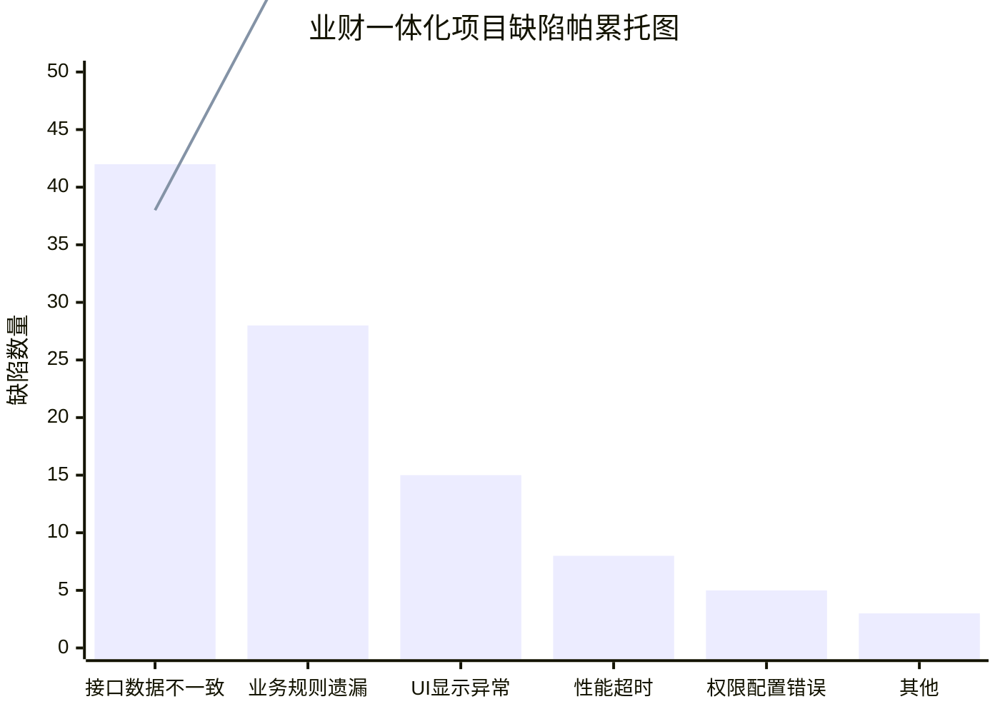
```mermaid
xychart-beta
    title "业财一体化项目缺陷帕累托图"
    x-axis ["接口数据不一致", "业务规则遗漏", "UI显示异常", "性能超时", "权限配置错误", "其他"]
    y-axis "缺陷数量" 0 --> 50
    bar [42, 28, 15, 8, 5, 3]
    line [38, 63, 77, 84, 89, 100]
```

> 柱状 = 各类缺陷数量，折线 = 累计百分比。80% 线对应前两类缺陷，聚焦改进。

### 15.2 帕累托分析表（考场直接画表）

| 缺陷类型 | 数量 | 占比 | 累计占比 | 改进措施 |
|---------|------|------|---------|---------|
| 接口数据不一致 | 42 | 39% | 39% | 建立接口契约测试，ETL 增加校验层 |
| 业务规则遗漏 | 28 | 26% | 65% | 需求评审增加业务专家参与 |
| UI 显示异常 | 15 | 14% | 79% | 前端组件标准化 |
| 性能超时 | 8 | 7% | 86% | 数据库索引优化 |
| 权限配置错误 | 5 | 5% | 91% | 权限矩阵自动化测试 |
| 其他 | 3 | 3% | 100% | — |

**考试画板绘制要点**：
- 左纵轴 = 数量（柱状），右纵轴 = 累计百分比（折线）
- 柱状从高到低排列
- 在 80% 处画一条虚线（关键少数分界线）
- 标注"二八原则"：前 2-3 项占总缺陷 80%

---

## 十六、控制图（质量管理）

**考试要点**：质量管理七工具之一，判断过程是否稳定。Sprint 缺陷密度控制图适用于质量管理论文。

### 16.1 缺陷密度控制图

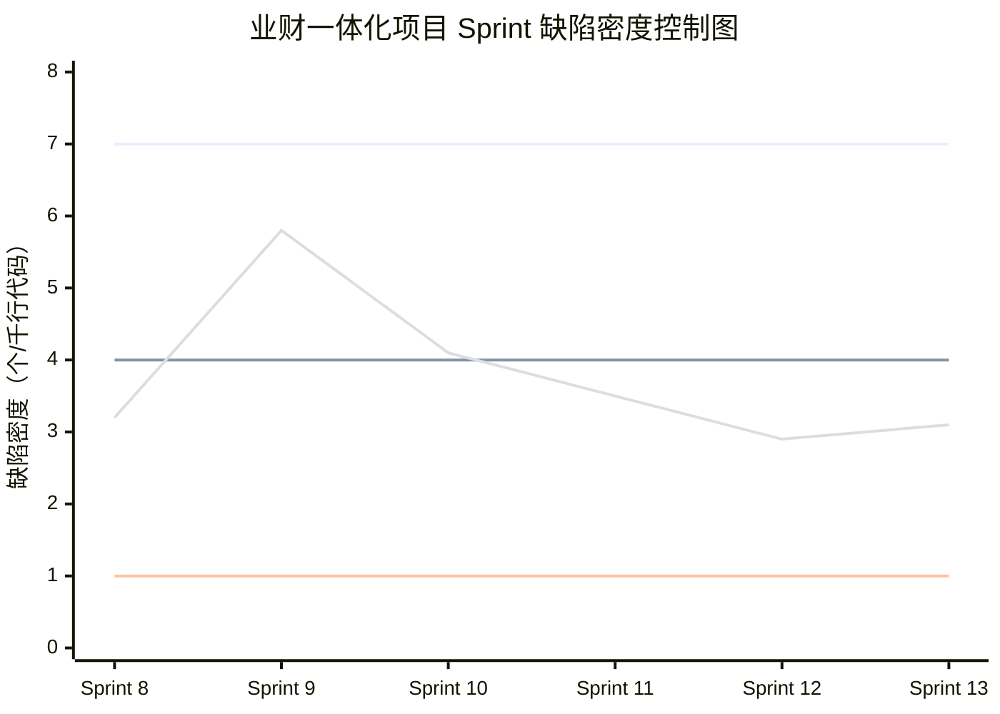
```mermaid
xychart-beta
    title "业财一体化项目 Sprint 缺陷密度控制图"
    x-axis ["Sprint 8", "Sprint 9", "Sprint 10", "Sprint 11", "Sprint 12", "Sprint 13"]
    y-axis "缺陷密度（个/千行代码）" 0 --> 8
    line [7.0, 7.0, 7.0, 7.0, 7.0, 7.0]
    line [4.0, 4.0, 4.0, 4.0, 4.0, 4.0]
    line [1.0, 1.0, 1.0, 1.0, 1.0, 1.0]
    line [3.2, 5.8, 4.1, 3.5, 2.9, 3.1]
```

> 上线 = UCL（7.0），中线 = CL（4.0），下线 = LCL（1.0）。Sprint 9 超出 UCL 为异常点。

### 16.2 控制图数据表

| Sprint | 缺陷数 | 代码行 | 缺陷密度 | UCL | CL | LCL | 判定 |
|--------|-------|--------|---------|-----|----|----|------|
| Sprint 8 | 16 | 5000 | 3.2 | 7.0 | 4.0 | 1.0 | 正常 |
| Sprint 9 | 35 | 6000 | **5.8** | 7.0 | 4.0 | 1.0 | ⚠️ 接近 UCL |
| Sprint 10 | 20 | 4900 | 4.1 | 7.0 | 4.0 | 1.0 | 正常 |
| Sprint 11 | 18 | 5100 | 3.5 | 7.0 | 4.0 | 1.0 | 正常 |
| Sprint 12 | 14 | 4800 | 2.9 | 7.0 | 4.0 | 1.0 | 正常 ✓改善 |
| Sprint 13 | 16 | 5200 | 3.1 | 7.0 | 4.0 | 1.0 | 正常 ✓稳定 |

**考试画板绘制要点**：
- 画三条水平线：UCL（上控制限）、CL（中心线）、LCL（下控制限）
- 用散点/折线连接各 Sprint 数据点
- 超出 UCL 的点用红色标注，表示过程失控
- 判定规则：连续 7 点在 CL 同一侧也视为异常

---

## 十七、沟通渠道分析与沟通节奏图（沟通管理）

**考试要点**：沟通管理（T2 梯队）核心工具。沟通渠道数 = N(N-1)/2，三阶段沟通节奏体现管理实践。

### 17.1 沟通渠道分析表

| 干系人层 | 人数(N) | 渠道数 N(N-1)/2 | 沟通频次 | 主要方式 |
|---------|---------|----------------|---------|---------|
| 核心决策层（CFO/业务总监/项目经理） | 3 | 3 | 每日 | 站会/即时通讯 |
| 扩展管理层（+两组组长） | 5 | 10 | 每周 | 周会/飞书文档 |
| 全量干系人（含事业部/外部顾问） | 9 | 36 | 每双周 | Sprint评审/邮件 |

### 17.2 三阶段沟通节奏流程图

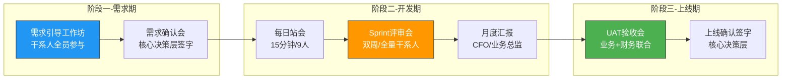
```mermaid
flowchart LR
    subgraph 阶段一-需求期
        A1["需求引导工作坊<br/>干系人全员参与"] --> A2["需求确认会<br/>核心决策层签字"]
    end

    subgraph 阶段二-开发期
        B1["每日站会<br/>15分钟/9人"] --> B2["Sprint评审会<br/>双周/全量干系人"]
        B2 --> B3["月度汇报<br/>CFO/业务总监"]
    end

    subgraph 阶段三-上线期
        C1["UAT验收会<br/>业务+财务联合"] --> C2["上线确认签字<br/>核心决策层"]
    end

    A2 --> B1
    B3 --> C1

    style A1 fill:#2196F3,stroke:#333,color:#fff
    style B2 fill:#FF9800,stroke:#333,color:#fff
    style C1 fill:#4CAF50,stroke:#333,color:#fff
```

**考试画板绘制要点**：
- 沟通渠道：简单表格，列出 N 和 N(N-1)/2 即可
- 三阶段节奏：三个方框 + 箭头连接，标注阶段名称/沟通方式/参与人

---

## 十八、自制或外购决策矩阵（采购管理）

**考试要点**：采购管理（T2 梯队）核心工具，展示自制/外购分析的决策过程。

| 需求类别 | 决策 | 合同类型 | 年费/预算 | 选择理由 |
|---------|------|---------|----------|---------|
| 金蝶云星空实施服务 | **外购** | FFP 固定总价 | 38万 | 财务系统专业化程度高，自有团队无金蝶开发能力 |
| ERP 主线开发 | **自制** | — | 内部人力 | 核心业务逻辑，需自主掌控源码和迭代节奏 |
| 影刀 RPA 平台 | **外购** | CPIF 成本加激励 | 8万 + 按场景计费 | 平台成熟度高，按使用量激励供应商优化场景 |
| 积加/马帮 ERP 接口 | **外购** | T&M 工料合同 | 按调用量计费 | SaaS 标准接口，用量波动大，工料灵活 |
| BI 数据看板 | **自制** | — | 内部人力 | 数据逻辑与业务深度绑定，需快速响应需求变更 |
| 发票智能识别 | **外购** | FFP 固定总价 | 5万 | 成熟 AI 能力，市场方案完善 |

**考试画板绘制要点**：
- 表格列：需求类别 / 决策（自制或外购）/ 合同类型 / 费用 / 选择理由
- 合同类型必须标注英文缩写（FFP/CPIF/T&M），体现专业度
- 选择理由简明扼要，1 句话即可

---

## 十九、需求跟踪矩阵（范围管理）

**考试要点**：范围管理核心工具，实现需求→WBS→设计→测试→验收的双向追溯。远比 RACI 在软考论文中考察频次高。

| 需求编号 | 需求描述 | WBS 编码 | 设计文档 | 测试用例 | 验收标准 | 状态 |
|---------|---------|---------|---------|---------|---------|------|
| REQ-001 | OA 审批自动推送金蝶应收单 | 1.2.1 | 接口设计 v2.3 | TC-001~005 | 单笔推送 ≤3s，批量 ≤30s | ✅ 已验收 |
| REQ-002 | 积加利润数据同步金蝶凭证 | 1.2.2 | 接口设计 v2.4 | TC-006~010 | T+1 日自动同步，准确率 99.5% | ✅ 已验收 |
| REQ-003 | ERP 采购管理模块 | 1.1.1 | 模块设计 v1.0 | TC-011~025 | 覆盖请购/采购/入库完整流程 | 🔄 开发中 |
| REQ-004 | 多店铺利润报表自动生成 | 1.2.3 | 报表设计 v1.1 | TC-026~030 | 支持 50+ 店铺，5 分钟出报表 | ✅ 已验收 |
| REQ-005 | 发票智能识别与核销 | 1.2.4 | AI 模块设计 v1.0 | TC-031~035 | 识别率 ≥95%，核销准确率 ≥99% | 🔄 开发中 |

**考试画板绘制要点**：
- 表头：需求编号 / 需求描述 / WBS 编码 / 测试用例 / 状态（最少列）
- 核心体现"双向追溯"：从需求→WBS→测试，以及反向
- 状态用 ✅🔄 标注
- 不需要画很多行，3-5 行足以说明概念

---

## 二十、风险概率影响矩阵（风险管理）

**考试要点**：风险管理核心定性分析工具，将风险按概率×影响分入高/中/低等级。

### 20.1 概率影响矩阵（4×4）

|  | 影响-低(0.1) | 影响-中(0.2) | 影响-高(0.4) | 影响-极高(0.8) |
|--|-------------|-------------|-------------|--------------|
| **概率-高(0.5)** | 🟡 0.05 | 🟠 0.10 | 🔴 0.20 | 🔴 0.40 |
| **概率-中高(0.3)** | 🟢 0.03 | 🟡 0.06 | 🟠 0.12 | 🔴 0.24 |
| **概率-中低(0.2)** | 🟢 0.02 | 🟢 0.04 | 🟡 0.08 | 🟠 0.16 |
| **概率-低(0.1)** | 🟢 0.01 | 🟢 0.02 | 🟢 0.04 | 🟡 0.08 |

> 🟢 低风险（监控） / 🟡 中风险（关注） / 🟠 高风险（主动应对） / 🔴 极高风险（立即行动）

### 20.2 风险登记册节选（配合矩阵使用）

| 编号 | 风险描述 | 概率 | 影响 | 风险值 | 等级 | 应对策略 | 责任人 |
|------|---------|------|------|--------|------|---------|--------|
| R-001 | 金蝶接口性能瓶颈 | 0.5 | 0.4 | 0.20 | 🔴 | 规避：Doris 缓冲层 + 异步批处理 | 数据效能组长 |
| R-002 | 跨系统需求变更频繁 | 0.5 | 0.2 | 0.10 | 🟠 | 减轻：CCB 审批 + 需求冻结期 | 项目经理 |
| R-003 | ERP 开发人员流失 | 0.2 | 0.4 | 0.08 | 🟡 | 减轻：交叉培训 + 文档标准化 | 业务系统组长 |
| R-004 | 外部 SaaS 服务商涨价 | 0.1 | 0.2 | 0.02 | 🟢 | 接受：预算储备 5% | 项目经理 |

**考试画板绘制要点**：
- 矩阵：4×4 表格，行=概率，列=影响，单元格标注风险值和颜色等级
- 颜色分区：绿/黄/橙/红 四级
- 风险登记册配合使用：列出 3-5 个具体风险及其等级和应对策略

---

## 二十一、真题高频补充图表（质量核对单/进度计划）

### 21.1 质量核对单（质量管理）

**考试要点**：2022 下质量管理真题子题目③明确要求"帮助 QA 制定一份质量核对单"。核对单是质量管理七工具之一（核查表），用于系统化检查交付物质量。

**业财一体化项目质量核对单模板：**

| # | 检查项 | 检查标准 | 检查方法 | 负责人 | 结果 |
|---|--------|---------|---------|--------|------|
| 1 | 接口数据一致性 | 业务系统与金蝶数据误差 ≤0.5% | 自动化对账脚本比对 | 数据效能组长 | ☐ |
| 2 | 凭证推送成功率 | OA→金蝶应收单推送成功率 ≥99.5% | 日志监控 + 异常告警 | 财务集成工程师 | ☐ |
| 3 | 利润报表准确率 | 多店铺利润汇总与手工核对偏差 ≤0.3% | 样本交叉验证 | 数据工程师 | ☐ |
| 4 | RPA 机器人稳定性 | 单场景连续运行 72h 无异常 | 自动化巡检报告 | RPA 工程师 | ☐ |
| 5 | 权限配置正确性 | 用户角色与功能权限 100% 匹配 | 权限矩阵自动化测试 | 前端开发 | ☐ |
| 6 | 页面加载性能 | 核心页面首屏加载 ≤2s | Lighthouse 审计 | 前端开发 | ☐ |
| 7 | 数据看板刷新延迟 | BI 看板数据延迟 ≤T+1 | 定时任务日志检查 | 数据工程师 | ☐ |
| 8 | 安全合规检查 | 敏感数据传输加密、接口鉴权完整 | 安全扫描 + 人工审计 | 项目经理 | ☐ |

**考试画板绘制要点**：
- 表头：序号 / 检查项 / 检查标准 / 检查方法 / 结果
- 检查标准必须**可量化**（百分比、时间阈值等）
- 不需要写太多行，5-8 行足以说明概念

---

### 21.2 进度管理计划内容表（进度管理/规划绩效域）

**考试要点**：2024 第 1 批进度管理真题子题目①明确要求"写出进度管理计划的主要内容"。注意审题：是"进度管理计划"（指南方向），不是"进度计划"（具体时间表）。

| 内容项 | 说明 | 本项目设定 |
|--------|------|-----------|
| 进度模型 | 项目进度编制和维护的方法 | 关键路径法 CPM + Sprint 迭代 |
| 计量单位 | 活动/资源估算的单位 | 工作日/人日/万元 |
| 精确度层级 | 估算的精确程度 | 近期 Sprint ±5%，远期 ±15% |
| 准确度层级 | 估算的可接受范围 | 自下而上估算 ±10% |
| 控制临界值 | 偏差预警阈值 | SPI < 0.95 触发审查 |
| 绩效测量规则 | 挣值测量方法 | 加权里程碑法（按 WBS 节点） |
| 报告格式 | 进度报告的格式和频次 | Sprint 燃尽图 + 双周进度报告 |
| 过程描述 | 进度管理各过程的执行程序 | 6 个子过程（定义活动→控制进度） |

**考试画板绘制要点**：
- 简单表格，列：内容项 / 说明 / 项目设定
- 核心区分：进度管理计划 = HOW（方法论），进度计划 = WHEN（时间表）
- 6-8 个内容项即可，不需要全写

---

## 附录：图表类型↔管理领域速查表

> **更新说明**：绩效域专用表格（预期目标表、协同关系表、域专用表）已整合至 performance-domains.md。本文件保留通用图表模板和真题高频补充图表。

| 图表类型 | 模板形式 | 适用管理领域/绩效域 | 备考梯队 | 历年真题出现 |
|---------|---------|-------------------|---------|------------|
| 甘特图 | mermaid `gantt` / 表格 | 进度管理 | 已考可跳 | 2024第1批 |
| S曲线 | mermaid `xychart-beta` / 手绘 | 成本管理 | 已考可跳 | 2024第2批（必画） |
| 网络图/PERT | mermaid `flowchart` | 进度管理 | 已考可跳 | 常见 |
| WBS分解树 | mermaid `mindmap` / 表格 | 范围管理 | T3 | 常见 |
| 权力利益方格 | mermaid `quadrantChart` | 干系人管理/绩效域 | T1 ✅ | 2023下第1批 |
| 参与度评估矩阵 | mermaid `block-beta` / 表格 | 干系人管理/绩效域 | T1 ✅ | 2023下第1批（必画两次） |
| 绩效域协同图 | mermaid `flowchart` | 绩效域论文 | 通用 | 2025上 |
| 风险应对流程 | mermaid `flowchart` | 风险管理 | 可跳 | 常见 |
| 业务流转图 | mermaid `flowchart` | 通用/背景段 | 通用 | 通用 |
| 变更控制流程 | mermaid `flowchart` | 整合管理 | T1 | 常见 |
| 生命周期阶段图 | mermaid `flowchart` | 开发方法和生命周期绩效域 | T3 | — |
| 度量仪表盘 | mermaid `flowchart` | 度量绩效域 | T3 | — |
| **挣值分析趋势图** | mermaid `xychart-beta` + 表格 | 成本管理/度量绩效域/规划绩效域 | **T1** | 常考工具 |
| **里程碑清单表** | 表格 | 整合管理/通用 | **T1** | 常考工具 |
| **项目管理计划组成图** | mermaid `flowchart` | 规划绩效域 | **T1** | — |
| **塔克曼五阶段模型** | mermaid `flowchart` | 团队绩效域 | **T2** | 常考理论 |
| **帕累托图** | mermaid `xychart-beta` + 表格 | 质量管理 | **T2** | 七工具之首 |
| **控制图** | mermaid `xychart-beta` + 表格 | 质量管理 | **T2** | 七工具之一 |
| **沟通渠道分析+沟通节奏** | 表格 + mermaid `flowchart` | 沟通管理 | **T2** | — |
| **自制或外购决策矩阵** | 表格 | 采购管理 | **T2** | 核心工具 |
| **需求跟踪矩阵 RTM** | 表格 | 范围管理 | **T3** | 常考工具 |
| **风险概率影响矩阵** | 表格 | 风险管理 | 通用 | 常考工具 |
| **质量核对单** | 表格 | 质量管理 | **T2** | 2022下真题要求 |
| **进度管理计划内容表** | 表格 | 进度管理/规划绩效域 | **T1**融合 | 2024第1批真题 |

> **梯队说明**：T1 = 第一梯队（必备考），T2 = 第二梯队（准备大纲），T3 = 第三梯队（仅大纲），"已考可跳" = 近年已考题目。绩效域专用表格（预期目标表、协同关系表等）详见 performance-domains.md。
