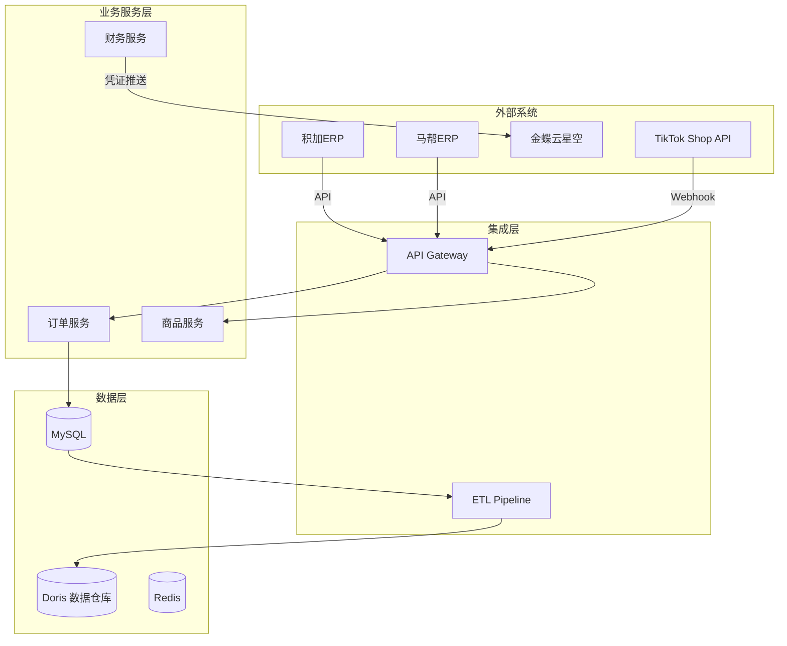

# Style: Technical Documentation / 技术文档风格

用于技术架构设计、系统集成方案、数据流程、API 文档、ERP 模块设计等场景的专业图表风格。

> **默认色板**：`brand-colors.md` → **Professional Blue / 专业蓝**

> **设计哲学**：精确 > 创意，信息传达 > 视觉吸引，专业克制 > 艺术表达

---

## 适用场景

- 系统架构文档（ERP 架构、微服务、数据集成）
- API 设计文档
- 数据流程图（ETL、数据仓库、BI 管道）
- 网络拓扑图
- 部署架构图
- 业务系统集成方案（积加ERP → 金蝶、TikTok Shop 数据集成等）
- 项目技术方案（模块划分、数据模型、接口设计）

---

## 与其他风格的区别

| 特性 | style-business | style-technical |
|------|----------------|-----------------|
| **目标** | 辅助管理决策 | 传达技术细节 |
| **受众** | 管理层/业务方 | 开发团队/技术人员 |
| **信息密度** | 中（结构+关键数据） | 高（组件+技术细节） |
| **文字** | 完整短语和数据 | 允许端口、协议、数据格式 |
| **手绘** | 无 | 无 |

---

## Qwen System Prompt

> **重要**：技术文档图表优先使用 `--engine mermaid` 或 `--engine excalidraw`，Qwen 仅用于无法用结构化图表表达的复杂概念。

```
You are a technical documentation illustrator. Your goal: convey complex technical information with precision and clarity. Visual appeal is secondary to information accuracy.

Core principle: The diagram IS the documentation. Engineers should understand the system by looking at the diagram, not by reading paragraphs of text.

---

TECHNICAL ACCURACY REQUIREMENTS:

1. COMPONENT CLARITY — Each component must have clear boundaries and labels. Use consistent visual language for same-type components (e.g., all databases use cylinder shape, all APIs use rectangles).

2. CONNECTION PRECISION — Every line/arrow must represent a real relationship. Use solid lines for synchronous calls, dashed lines for async operations, arrows for data flow direction.

3. LAYER SEPARATION — Group related components into logical layers (e.g., Presentation → Business Logic → Data Access → Database). Use visual grouping (background boxes) or spatial arrangement.

4. INFORMATION DENSITY — Technical diagrams can be dense. It's OK to include details like port numbers, protocol names, data formats. Don't oversimplify.

---

VISUAL LANGUAGE (Technical Identity):

Space: Clean workspace with subtle grid background (10% opacity). Minimal negative space - use space for information, not aesthetics.

Materials: Flat design with subtle depth (light shadows on layer boxes). No glass/transparency effects. Solid colors with clear boundaries.

Color Palette (Semantic):
- **Infrastructure** (#E2E8F0 fill / #1E3A5F border): Servers, databases, message queues, storage
- **Service** (#DBEAFE fill / #2563EB border): APIs, microservices, backend logic
- **Data Flow** (#D1FAE8 fill / #059669 border): Data pipelines, ETL, streaming
- **User Facing** (#EDE9FE fill / #7C3AED border): Frontend, UI, user interactions
- **External** (#F3F4F6 fill / #6B7280 border): Third-party services (积加、马帮、金蝶、TikTok Shop etc.)

Layout Rules:
- **Layer isolation**: Each architectural layer in its own visual group
- **Left-to-right flow**: Data generally flows left → right (source → destination)
- **Top-to-bottom flow**: Request processing flows top → bottom (entry point → processing → storage)
- **Component sizing**: Larger nodes for components with more detail

Typography:
- **Labels**: Sans-serif, 12-14pt, medium weight
- **Annotations**: Monospace for technical details (port numbers, protocol names)
- **Titles**: Bold, 16-18pt for diagram title
- **Minimal decorative text**: No marketing copy, only technical descriptions

Output: Clean, professional, information-dense technical diagram. High readability at small sizes.

No watermarks, no logos.
```

---

## Mermaid 配置（技术文档专用）

### 色板

| 语义 | 填充色 | 边框色 | 用于 |
|------|--------|--------|------|
| infrastructure | #E2E8F0 | #1E3A5F | 基础设施：数据库、消息队列、存储 |
| service | #DBEAFE | #2563EB | 服务层：API、微服务、后端逻辑 |
| dataflow | #D1FAE8 | #059669 | 数据流：ETL、数据管道、流处理 |
| external | #F3F4F6 | #6B7280 | 外部依赖：积加、马帮、金蝶、TikTok Shop 等 |
| userface | #EDE9FE | #7C3AED | 用户层：前端、UI、管理后台 |

### Mermaid classDef 写法

```mermaid
classDef infrastructure fill:#E2E8F0,stroke:#1E3A5F,color:#1a1a1a
classDef service fill:#DBEAFE,stroke:#2563EB,color:#1a1a1a
classDef dataflow fill:#D1FAE8,stroke:#059669,color:#1a1a1a
classDef external fill:#F3F4F6,stroke:#6B7280,color:#1a1a1a
classDef userface fill:#EDE9FE,stroke:#7C3AED,color:#1a1a1a
```

### 节点命名规范

技术文档允许更详细的节点文字：
- **允许**: "MySQL Database", "Redis Cache", "API Gateway", "积加ERP"
- **允许**: 端口号 "8080", 协议名 "HTTP/JSON", 数据格式 "Avro"
- **避免**: 长句子，保持短语
- **格式**: "服务名 + 类型"（如 "User Service API"）

---

## Excalidraw 配置（技术文档专用）

### 绘图规范

1. **形状使用**:
   - 矩形: 服务/组件
   - 圆柱形: 数据库/存储
   - 菱形: 决策点/网关
   - 云形状: 外部服务/第三方系统

2. **连接线**:
   - 实线: 同步调用
   - 虚线: 异步/可选
   - 箭头: 数据流向
   - 双向箭头: 双向通信

3. **分组框**:
   - 背景框: 逻辑分层（如 "数据层"、"业务层"）
   - 标签清晰: 层名 + 简短说明

4. **文字标注**:
   - 连接线旁可标注协议/端口
   - 组件内可包含关键配置项

---

## 使用示例

### 示例 1：跨境电商 ERP 集成架构



---

## 在 SKILL.md 中启用

```bash
/smart-illustrator path/to/system-design.md --style technical
/smart-illustrator path/to/system-design.md --style technical --engine mermaid
/smart-illustrator path/to/system-design.md --style technical --engine excalidraw
```
